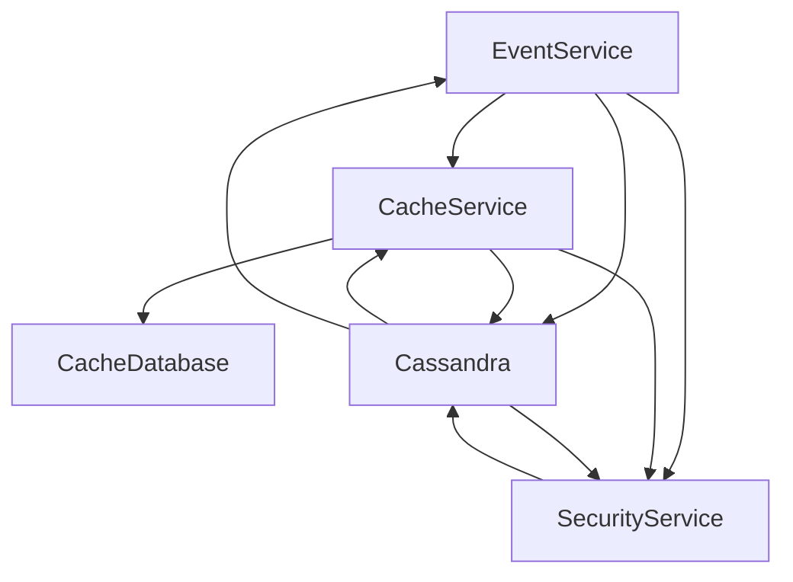

## CPU eviction
#### Page replacement Algorithms
[Page Replacement Algorithms in Operating Systems - GeeksforGeeks](https://www.geeksforgeeks.org/page-replacement-algorithms-in-operating-systems/)
[Advantages and Disadvantages of various Page Replacement algorithms - GeeksforGeeks](https://www.geeksforgeeks.org/advantages-and-disadvantages-of-various-page-replacement-algorithms/?ref=rp)
[Second Chance (or Clock) Page Replacement Policy - GeeksforGeeks](https://www.geeksforgeeks.org/second-chance-or-clock-page-replacement-policy/?ref=rp)
[Not Recently Used (NRU) page replacement algorithm - GeeksforGeeks](https://www.geeksforgeeks.org/not-recently-used-nru-page-replacement-algorithm/?ref=rp)

1. **FIFO** 
**Belady's anomaly** proves that it's possible to degrade performance when increasing the cache space while using the **FIFO** algorithm
**Advantages**
	- **Fair** : 
		All pages have equal chance of being replaced. The oldest one is replaced first regardless of its usage frequency or importance.
	- **No starvation**
		Pages will be eventually be replaced if it has been in memory for a long time, even it is frequently used
	- **Predictability**
		The order in which pages are evicted is predictable and does not depend on the page usage patterns or history
	- **Low overhead**
		Meaning that it requires low resources + fast

**Disadvantages**
	- Not effective, high number of page faults (cache misses)
	- Prone to Belany's anomaly
	- **Inefficient use of memory**
		Some pages that are rarely used or not important may occupy memory for a long time
	- **Suscesptibility of thrashing**
		This happens when the number of pages needed by the workload exceeds the available physical memory and so the system spends too much time swapping pages in and out of memory without making progress on the workload
	- **Unfairness**
		FIFO is fair in the sense that it treats all pages equally but it might not be from the workload perspective, replacing a page that is used frequently can lead to degraded performance.

2. **Optimal Page Replacement**
Pages are replaced which would not be used in the longest duration of time in the future.
Optimal page replacement is perfect, but no possible in practice as the os cannot know future requests. The use of OPR is to set up a benchmark so that other replacement algorithms can be analyzed against it.

3. **Least Recently Used** 
Replacing pages that are least recently used, a.k.a. haven't been used in the longest time

4. **Most Recently Used**
Replacing pages that have been used the most recently xD. **belady's anomaly** can occur in this algorithm

5. **Second Chance**
This algorithm traverses the array of cached keys and tries to swap the key if the second chance boolean is false otherwise it sets it to false and keeps going. The second boolean is set to true whenever the page is referenced

6. **Not Recently Used**
Keeps track of **Referenced** & **Modifiend** bits, removes pages randomly with this priority
	Not Referenced & Not Modified
	Not Referenced & Modified
	Referenced & Not Modified
	Referenced & Modified
It is certainly not optimal but in some cases it yields good results.

> [!WARNING] 
> **Belday's anomaly** can occur in many algorithms namely :
> - FIFO
> - Second chance algorithm
> - Random page replacement algorithm

**Optimal** and **LRU** can never have belady's anomaly because they belong to a class of **stack-based algorithm**.

